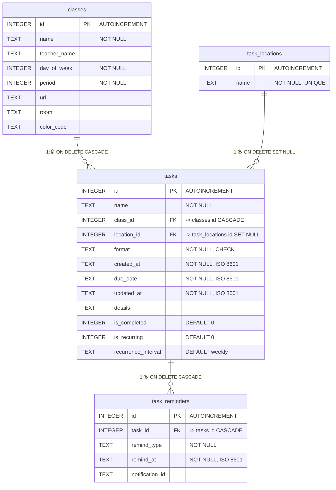

# データベースER図 (v2.0)

改訂版 `database_design.md` に基づくエンティティ・リレーションシップ（ER）図です。

### 制約一覧

| テーブル | 制約 | 説明 |
|:---|:---|:---|
| `classes` | `UNIQUE (day_of_week, period)` | 同じ曜日・時限の授業重複を防止 |
| `tasks` | `CHECK (format IN (...))` | タスク形式を許容値に制限 |
| `task_reminders` | `UNIQUE (task_id, remind_type)` | 同一タスクへの同種通知の重複を防止 |

### インデックス一覧

| テーブル | インデックス名 | 対象カラム |
|:---|:---|:---|
| `tasks` | `idx_tasks_class_id` | `class_id` |
| `tasks` | `idx_tasks_due_date` | `due_date` |
| `tasks` | `idx_tasks_is_completed` | `is_completed` |
| `task_reminders` | `idx_reminders_task_id` | `task_id` |
